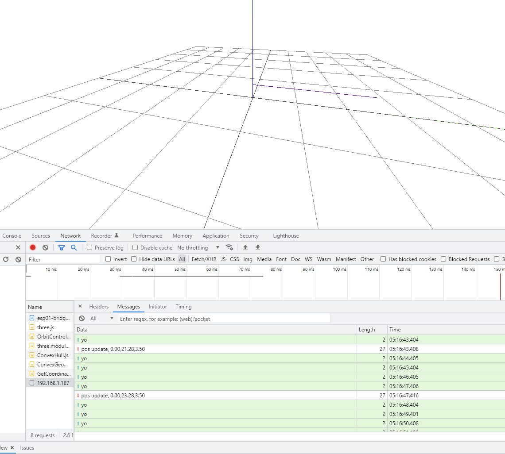
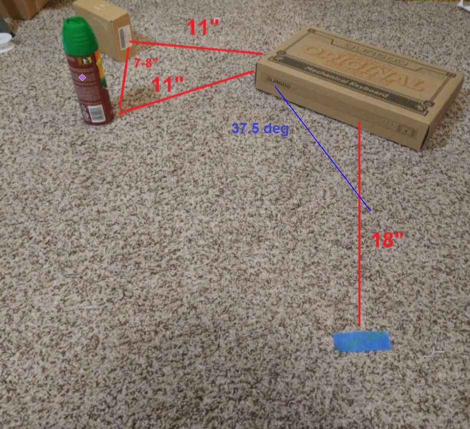

I have to do a major update/mental wrap up on this project and then devote myself to something else for a bit (work related).

Today I had an incident where as the sole-tech person I wasn't there (sleeping) during business hours. So until we can hire someone else that can do upkeep I need to get back on a regular schedule. I've been trying but my resolve has been weak.

Of course this problem was the standard pains of cross-browser-version feature support issues.

Immediate tasks:
- [x] check that turning is still good
- plot forward walking distance
  - this is good to get refamiliarized with the ESP-01 data transmission/real time plot
- plot turning as well
- make ThreeJS function to draw a cube
- do basic collision math

Ugh still having dumb problems like "this function comes after where it's called" which there is a fix for that not sure if it's namespace or something or class based, anyway...

I moved stuff around, man this code is super nasty now

Going to do hourly updates to make sure I make progress.

### 2 AM (2:06 now)

- created separate files for variables/telemetry, using `dumpData()` function to start telemetry plot.

So what has to happen is I perform the math locally for tracking move forward
- each step
- take ms elapsed
- multiply against m/s^2 to get velocity
- multiply to get f/s
- sum time, sum f/s and then multiply together (this is not great
  but incremental summing does not produce the right result)

nmapping if esp changed addresses

Still the same not connecting hmm

I was supposed to do a more thorough planning but I'll do all the bare minimum for now.

Thorough meaning based on sample available, minimum distances measured

There is still a buffer build up problem so I need to check that before writing to it

Ehh running into problems with strings/char/dynamic size

Sticking with String for now, tried std::string too

This approach will be nasty because I'm mixing "data types" well message types anyway.

String is general purpose if you parse it but yeah it's not JS running on a quadcore/lots of memory/etc...

Still dealing with the issue of double strings for stuff sent to ESPO1

Wonder if I need to flush on the ESP side

### 3 AM
Trying `Serial.flush()` call on ESP side

I still hae this problem of double messages

I don't get it, I use a local check, a Serial.flush() check it's still writing twice

I will try a millis call

Right now I'm using 1 second delay will try longer, that's working

I'm good with this because normally it would not send every second

I'm going to use some previously recorded values to populate fake sampling and write math against it.

3:52 AM
Performing first walk test with dumped elapsed distance compared against tapemeasure/real world.

Math is wrong...

### 4 AM
4:12 AM math still problematic, spreadsheet has it right, my Arduino math is wrong

4:35 AM
There is a weird discrepency where the elapsed time jumps from the standard 0.09-0.023 to 1 second it's odd

It might be when it does the pull forward command as it does happen at the middle of the measurements

The backwards tipping is nasty

Still getting wrong values, sucks to correct eg. expect to move 2" but measure 0.72"

Wtf something happened to Teensyduino not listening to flash/compile commands

### 5 AM
So I'm going to get the ThreeJS plotter working now.

Everytime it gets a `pos update, 0.00,0.00,0.00` command it will update the plot/add onto existing lines.

Cool so at this point I have a line that's plotting/updating as the robot moves forward.

Yuck... my fingers are so gross right now/sweaty-grimey.

5:28 AM
The thing I'll work on next (food break) is the ray-polygon collision aspect because that's harder than repeating the above for turning.

What I want to do is average the sample out so it's easier to do math on.

Then do real-world test to see if it detects it with some basic insights (what's the word here)

### 6 AM
Back on at 6:20 AM

This is interesting

I think even 1 body legnth forward is good.

The 20 deg scan has a 13.74" clearance directly in front so the image above would work/should trigger it.

I need to do a scan so I can see an example of it running/conceptualize.

Just sucks I have to work that out/plot it again... time consuming task.

The 37.5 deg ref angle is one turn

The blue tape is where the robot's ToF sensor would be at "0"

This is an interesting case where you know the robot has to turn twice or it will hit that box but how does it know?

Will be interesting to see the 47" infinity catch all vs. something beyond 10"

I did not sleep that much for the almost 2 days up... I'm feeling tired now even though haven't even been up 12 hours yet since I woke up at 10 PM

Okay I'm prepped have to update this desktop but will be on the Mac to get samples

6:40 AM
There is one thing I want which is to turn this thing off with a button. Not the MCU reset button but a stop button the web interface so I'll add that real quick/test it.

Ahh throwback this song Cinema by Benny Benassi damn... that was like 11 years ago I was listening to this video/clinging onto the fantasy of escape (from poverty).

I'm at the point where this project is just bad and I need to wrap it up/make a better one in the future.

<<<<<<< HEAD
### 9:00 AM
Ahh man slowing down

I will get something done to post an update, I recorded a dumb video I thought it was funny at the time but it fades

As I mentioned this project is just a disappointment due to the inaccuracies, I have to take each part apart and go farther.

I think I'm going to jump to the turning so I can at least track that/include.

The polygun math I might cheat and just loop through them all for now/note if anything is out of ordinary.

I'm getting distracted

Ahh man... nostalgia hitting me hard I know we're cool by Gwen Stefani

That's Wisconsin for me man 2006 or so

OMG... REEEEEEEEEE getting distracted

9:30 AM

I was trying to think about the rotation thing, I need some math for that for the new vector

Man the passage of time is sad ugh

Man I'm so tired... again this is why I hate being poor and not being free.

Only reason I care about 9-5 is that's when everyone else does business.

Granted for a long time now I haven't had a life, I just work/sleep/do personal things but that's it.

Ugh man the measured rotation is not right, I'm getting 22 deg when it should be 30-40

Holy crap it turns 52 deg... this could go back to that swaying thing (pan tilt sweep) where it only measures out half

So 20's is not such an odd number, granted it has to be above 25

I got -23.5 on that last run so yeah it's not accurate... I'll just hard code that if the correction threshold is not met

10:22 AM
So far I don't have the right math (matches spreadsheet) in Arduino side

Ehh... it's like it's close but it's not, it measured 40.72 this time... maybe the new battery helps

Also that's wrong the spreadsheet measures -22 ugh...

wtf... I burned a servo out after it turned and it was just sitting there... like smelling burning burned

from pull earlier
Ehh... what's bad is when it returns from sweep the robot moves a little.

Also I am now using AAA battery which while it helps a little with the tipping... it also makes the robot really close to falling over on D2 ugh... this whole project is just a shame.

I burned at least two servos out wtf...

