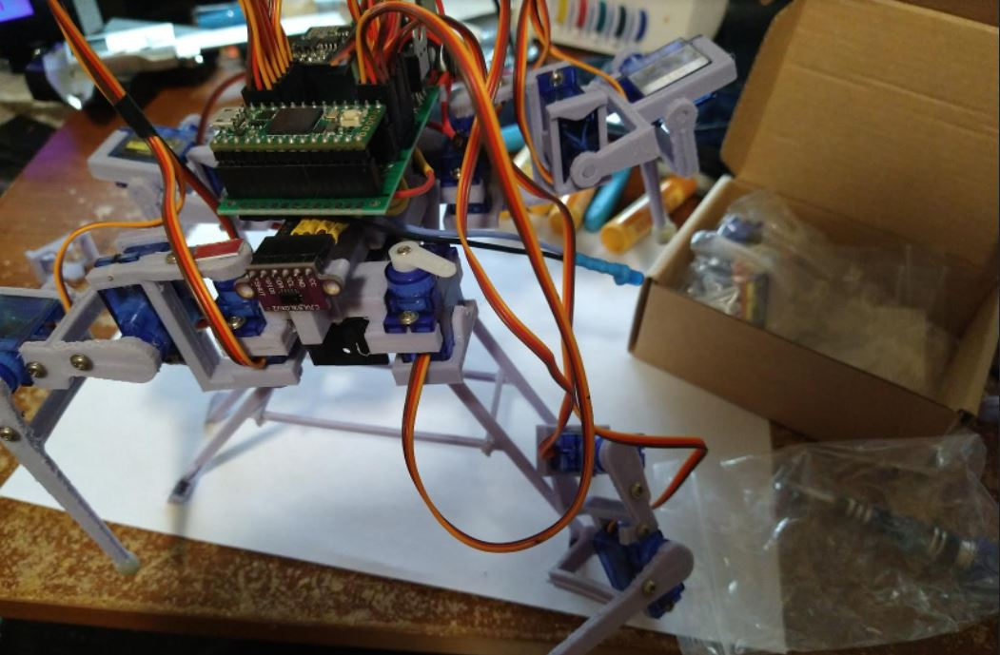

A brain dead day today, so going to replace all these servos.

Doing all is probably excessive but I want to make sure they're all good going forward.

And the code will ensure that I don't burn the servos out (try not to).

While there isn't like a switchable current shunt on here to read current draws per servo... well I'm just making that point.

I thought about it how to monitor the current draw per servo.

At the garage

What'll be neat is some servo boots will be new/using white PLA so it's like a highlight/adds character.

