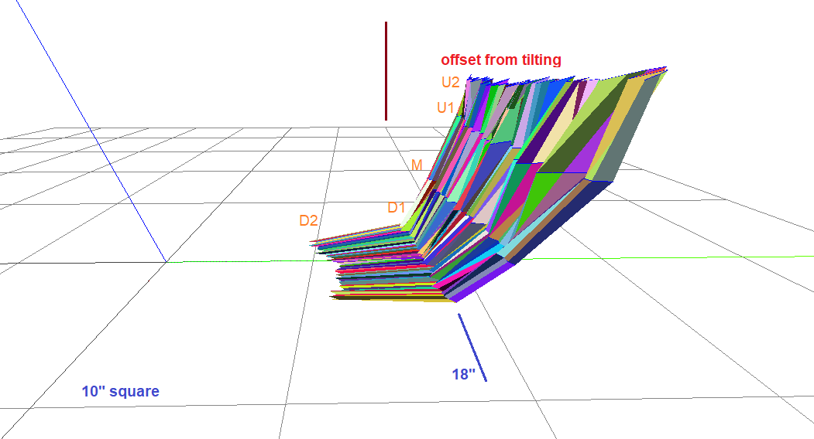

12:35 PM

A day off nice...

Gonna get the pan-tilt stuff updated. I have to fix a leg right now as it's not mostly vertical in the neutral state.

12:46 PM
I think future gaits I write will use the other method where it's not hardcoded values rather a "move by this amount" and then some abstracted underlying math does the calculations/keeps global servo positions updated.

Man... got so many things to update (cries)

Let me check the forward/turn gaits real quick make sure they still look good after the recent changes.

DOES... NOT... WALK... STRAIGHT!!! REEEEEE

I have to fix the turning because the outer legs are too far out and the leverage is too much for the servos, current draw gets too high it just dies.

Ehh... this is not something I want to fix now, I'll just keep in mind not to turn too many times in a row.

I'll probably do a code-refactor at some point

Think the fix is to curl the outer legs inwards during the pivots so they're closer to the body/less moment arm.

These servos are garbage and I was stupid to use them in a robot.

Looks like the back left leg does not go as far back hence the tipping

1:38 PM
back left leg loses grip too

It still slowly turns left but it's good enough

1:55 PM
Crying meme right here

- [x] tiltUp1
- [x] tiltUp2
- [x] sweep1
  - [x] pivotRight
  - [x] pivotCenterFromRight
  - [x] pivotLeft
- [x] tiltCenterFromUp2
- [x] sweep2
  - [x] pivotCenterFromLeft
  - [x] pivotRight
- [x] tiltCenterFromUp1
- [x] sweep 3
  - [x] pivotCenterFromRight
  - [x] pivotLeft()
  - [x] pivotCenterFromLeft
- [x] tiltDown1
- [x] sweep2
  - [x] pivotCenterFromLeft
  - [x] pivotRight
- [x] tiltCenterFromDown2
- [x] tiltCenterFromDown1
- [x] tiltDown2

Gotta check all of those/update values... then film it doing the motions for tilt up/down and sweep to update angles for math

I'm going to revert the commands back to before I did the servo changes then update them from there

What's concerning is I already updated some other commands ugh

This is a real cluster f good job Jacob

2:25 PM
Ahh man... gotta achieve something noteworthy today

Like plotting the boxes in ThreeJS as it moves

I'm also going to at one point do an exclusive IMU test thing only, will print a test right and move it around/program it, really nail it.

2:33 PM
Ahh back to my roots Catch Hell Blues

Now let's see if it looks good or not

Nope, it's skipping steps and legs aren't touching the ground

2:42 PM
Guess I gotta run each step and see what's wrong

2:55 PM
Dead leaves and the dirty groun ahh that intro breakdown

Yeah so what I'm doing is keeping track of the servo positions and making sure they don't jump... it is nasty because already the front-left outer leg is not in a good position.

I'm doing this work with two different computers/monitors

3:20 PM
I think as I'm updating the new angles, I'm going to include the mechanical offset too from when it tilts backwards, it can be crude eg. just the tilt but even factoring that in, that'll help with the math.

I have to finish the slated goals for this project before I put it aside/work on something else.

3:28 PM
There's something wrong with the front-right leg on tilt down it tilts too far down

3:44 PM
Going to get the tilt angles then measure sweep externally though IMU gets it

Damn down is really far down

3:57 PM
Oh man... I'm gonna have to do a new mesh plot... idk maybe not.

I'm using sketchup to update the angles/scans

So the ToF sensor from a sideways view is 0.75" above the rotation line.

Lowest front scan open space d2 clearance is 8.24"

0.3" in is the largest offset from the pitch up, sweeping would be different

Forward distance from tilt forward is not much 0.12"

17.67" d1 clearance

21.26" for u2 clearance (10" height)

32.24" for u1 clearance (10" height)

Ahh some I Mother Earth

Okay now to get sweep

4:14 PM
I'll do one open scan mesh thing, I'll update that code with the angles and what not.

This is like re-calibration

A good robot would just do it on its own

18.7 deg to the right

The turning is not symmetrical hmm

Looks like I can assume at least 15 deg coverage left/right

4:24 PM
Alright going to collect some data, target is 2 feet away (wall)

Ehh that's a bit excessive, will do 18"

That's odd after it scans it moves over like 1.4" to the right parallel from where it started.

It's also in a strained position (servos are louder)

I think I measured at 16" too (red mark on tape)

it's the last step that makes it jump over

The strain is from the leg tips being close together/carpet not letting the legs slide

4:39 PM
I've got to do something new today, I've just got back to where I was a couple days/week ago.

Oof... forgot to sample the gyroZ damn... gotta redo it again

4:53 PM
I think I turned this off due to my lazy algo not factoring in sweep angle/where specifically the obstacle was detected.

5:09 PM
Ahh man... slow going

5:10 PM
I've already started but let me time this

Crap the data is cut off on last two scans ugh.... wonder if it's not dumping data

5:22 PM
Got new measurements for D1/D2

Back to parsing this data

5:35 PM
done parsing

So say 20 mins it takes to just align the spreadsheet data come up with sweep vs. depth to be put into the mesh plotter

5:42 PM
Moment of truth... broken great

Ehh it's okay, still need to remove the back tilt effect

Looking at this graph it is clear the left/right sweep is not very wide.

Need 6" of clearance to be able to rotate.

