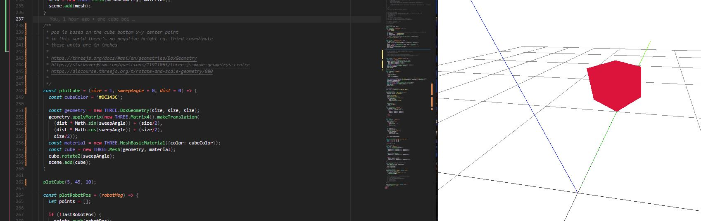
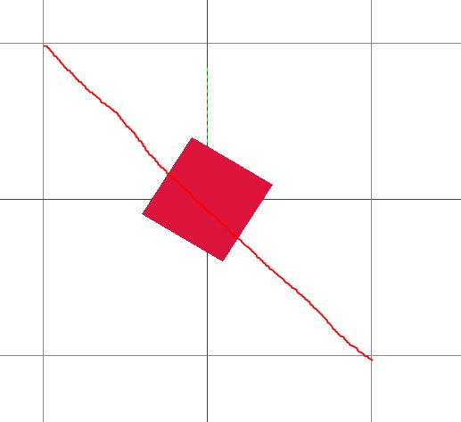
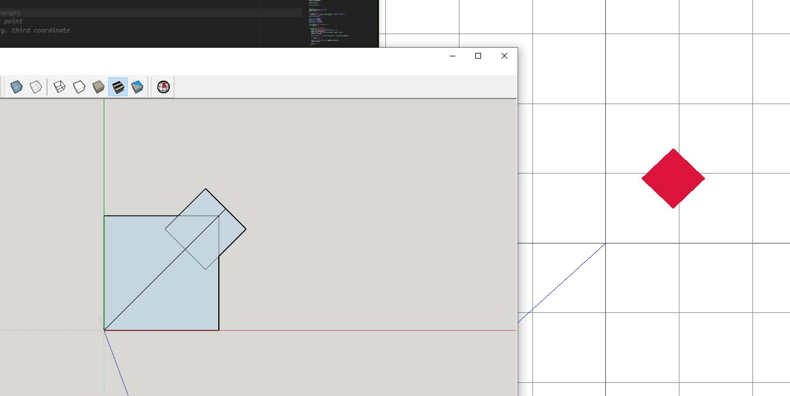

6:40 PM
A bit spent but I think I can get something "significant" done here.

I'm going to make a function to plot cubes in ThreeJS. These cubes will be able to accept a size and orientation/angle.

Trying to think how you would plot a cube. I have plotted planes before, need four points.

And just rotate the angles by 90 deg.

7:17 PM
Ehh cube has 6 faces I'm just setting them up manually

8:10 PM
hmm... rotating a plane interesting

really I just have to rotate the starting points but the 0, 0, 0 point is not "0" if you want to be able to rotate it.

I think I actually have to split the two points in half and rotate them in opposite direc

lol.. or... use ThreeJS whichh as built in cube methods

Yeah it treats the cube center as the centroid

OMG... lol so [easy](https://discourse.threejs.org/t/rotate-and-scale-geometry/880)...

Now we're jammin

8:30 PM
Ugh... stuck why is it not moving to the right

9:01 PM
OMG it's slightly off like ahhh

it's weird 45 degrees doesn't look like 45 degrees, not sure if it's a screen "tare" thing that thing where it cuts what you can see... forget the term.

WTF is this, this is not 45 degrees

OMG it's using radians damn it... I probably did this before to make the mesh plotter

OMG there it is... beautiful 45 degrees

MF... JS is in radians too ahhh okay I'm getting there

OMG finally...

