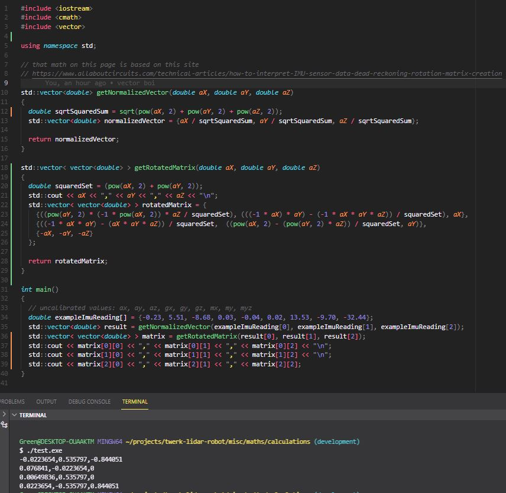
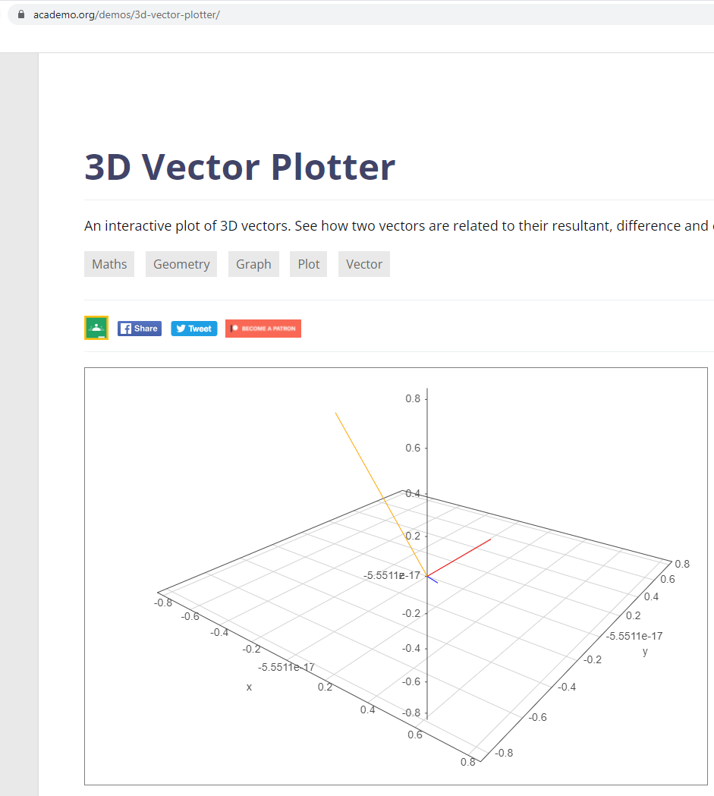

Going to read another site. That paper may be too technical idk.

Reading this [site](https://www.allaboutcircuits.com/technical-articles/how-to-interpret-IMU-sensor-data-dead-reckoning-rotation-matrix-creation).

An example "rotaiton matrix" is provided and it looks more tangible.

Oh man... gotta deal with calibration too.

Calibration links I'll look at: [site1](https://thecavepearlproject.org/2015/05/22/calibrating-any-compass-or-accelerometer-for-arduino/), [site2](https://github.com/kriswiner/MPU6050/wiki/Simple-and-Effective-Magnetometer-Calibration)

Euler angles

trig is bad

three-dimensional vector that lies on the unit sphere

right hand rule positive ahh nice

Normalize... I don't know if I need this "target vector" aspect yet.

Maybe with regard to being "upright" in a room.

I'm using values from the IMU I got like 2-3 weeks ago.

Want Z component to be near 9.8 so that this is the gravity axes

Dot product

part of vector A projected onto vector G

Hmm so yeah this is just part of it.

Okay so this 3x3 matrix is the starting point of the robot

Actually, would be a cool test to read the data/get the numbers, plot it into a 3D world and see if it looks right.

Ooh... I'm so used to JavaScript but I'll work on doing this all in C++ for the robot.

The magnetometer reading looks somewhat correct where I'm at in Kansas the value is between -30 and -35... then there's the blue line... which is something like 47...

So I guess... once you have this starting matrix, you can then multiply future readings against it to have a new orientation...

So I wrote this math but idk what it means... or if it's right. I plotted it and I don't understand what I got or if it maeks sense... ahhhhhh.

Plotted looks like this

Well... not a complete loss, did some math programming in C++ that's cool.