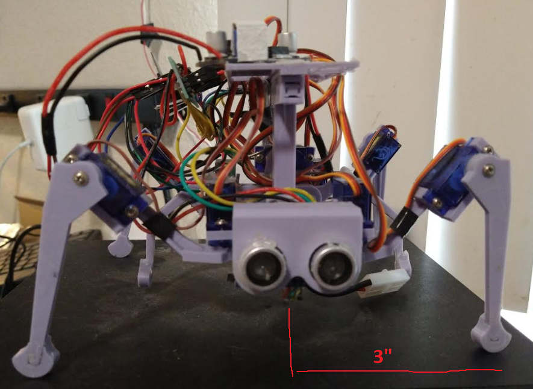

### Servos and leg length

So far the robot weighs 7.2oz and that's just bare parts, no wires, plastic, nothing.

If it weighs 10oz then the arms should not be longer than 5 inches. That's too long really means can only lift like 3 oz.

Which you would think is plenty but my real robot it was weak and it weighs 10.7oz.

Oh... I did have a thought, when it's moving it will be on 3 legs usually. So the torque might get up to 3.3oz or more.

Yeah I think I need to keep it light and keep the servos close together.

Pulling servo torque data from this [video](https://www.youtube.com/watch?v=X5KyveL1cWc).

